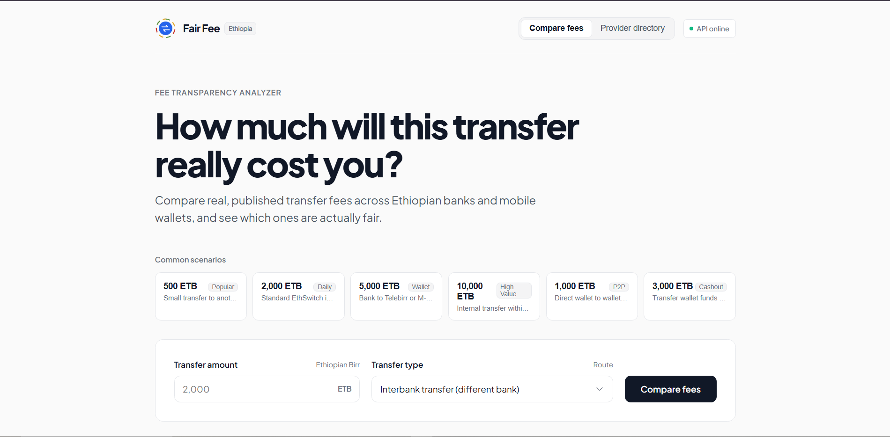

# Fair Fee

Compare Ethiopian mobile banking transfer fees across providers, and see
which ones are proportional vs. regressive to small transfers.

**Live demo:** https://fair-fee.vercel.app
**API docs:** https://fair-fee-api.onrender.com/docs


## Example — sending 2,000 birr interbank

| Provider | Fee | % of transfer | Fairness |
|---|---|---|---|
| Awash Bank | 4 birr | 0.2% | proportional |
| Dashen Bank | 8 birr | 0.4% | proportional |
| CBE | 57.5 birr | 2.88% | highly regressive |
| Bank of Abyssinia | 100 birr | 5.0% | highly regressive |

Same transfer, 25x price difference — and the fairness score explains why,
not just what it costs.

## Stack

Python · PostgreSQL · dbt · FastAPI · SQLAlchemy · Docker · GitHub Actions CI

## Architecture

```
Official sources → raw JSON → Postgres → dbt staging → star schema
→ fairness scoring → FastAPI
```

Full methodology and known data gaps: [`docs/methodology.md`](docs/methodology.md)

## Setup (for local development)

```bash
# 1. Create a Postgres database, set credentials in .env (see .env.example)
# 2. Copy fee_warehouse/profiles.yml.example to ~/.dbt/profiles.yml

pip install -r requirements.txt
python src/load_raw_to_postgres.py

cd fee_warehouse
dbt run && dbt test

cd ..
uvicorn api.main:app --reload
```
Docs at `http://localhost:8000/docs`.

## Endpoints

Live: `https://fair-fee-api.onrender.com`
Local: `http://localhost:8000`

- `GET /api/fees/compare?amount=2000&transfer_type=interbank_mobile`
- `GET /api/fees/cheapest?amount=2000&transfer_type=interbank_mobile`
- `GET /api/providers/cbe/fairness`
- `GET /api/providers/cbe/complaints`

Transfer types: `own_bank_mobile`, `interbank_mobile`, `to_wallet_mobile`,
`p2p_wallet`, `to_bank`, `own_account_mobile`

## Data sources

CBE, telebirr, Dashen, Awash, and Bank of Abyssinia — official tariff
pages/PDFs. M-Pesa Ethiopia — mixed confidence, flagged in the data.

## Beyond the core comparison

- **Complaint sentiment analysis** — real fee complaints from public app
  reviews, correlated against fairness scores. Small sample, honest
  limitations documented in `docs/methodology.md`.
- **Orchestrated pipeline** — the full load → transform → test sequence
  runs as a single Dagster job (`orchestration/pipeline.py`).